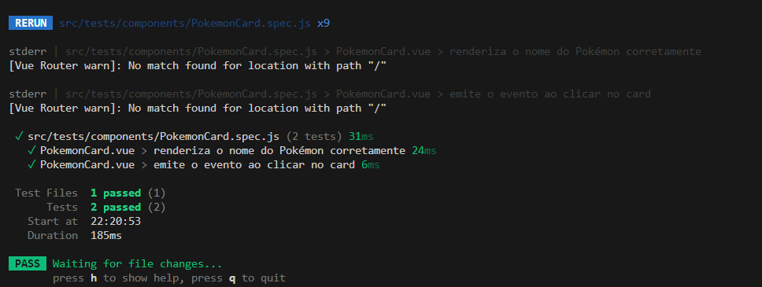

# Pokédex Vue 🧩

Aplicação web desenvolvida como parte de um desafio.
Este projeto consiste em uma Pokédex construída com Vue.js 3, consumindo dados da PokeAPI.
Você pode consultar esse projeto aqui:
- https://pokedex-vue-one.vercel.app

---

## 🚀 Tecnologias Utilizadas

- [Vue.js 3](https://vuejs.org/)
- [Vite](https://vitejs.dev/)
- [PokeAPI](https://pokeapi.co/)
- HTML + CSS + JavaScript
- Bootstrap 5

---

## 📲 Funcionalidades

### ✅ Funcionalidades obrigatórias:

- 🔍 **Listagem com Scroll Infinito**
  - Lista contínua de Pokémons com carregamento dinâmico
- 🎯 **Filtros**
  - Filtros por Nome, ID, Tipo e Espécie
- 📄 **Página de Detalhes**
  - Todos os sprites do Pokémon
  - Lista de movimentos (ataques)
  - Linha evolutiva completa (se houver)
  - Lista de games em que o Pokémon aparece

### ⭐ Funcionalidades diferenciais implementadas:

- 🔁 Aplicação responsiva para mobile e desktop
- 🌐 Internacionalização com suporte a:
  - Português 🇧🇷
  - Inglês 🇺🇸
  - Espanhol 🇪🇸
- 📦 Gerenciamento de estado com VueX
- Testes automatizados simples utilizando vitest, vuetest e jsdom

---

## Testes Automatizados:



---

## 🛠️ Como Rodar Localmente

```bash
# Clone o repositório
git clone https://github.com/oizamadpedro/pokedex_vue.git

# Instale as dependências
npm install

# Inicie o servidor de desenvolvimento
npm run dev

```

---